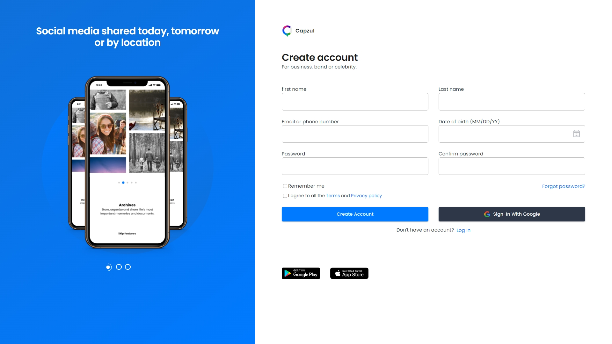
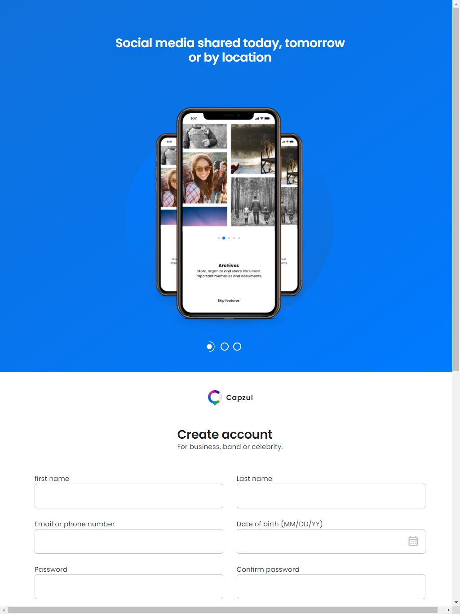
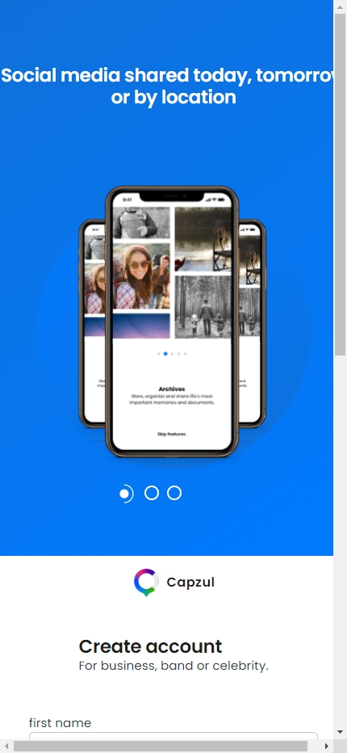
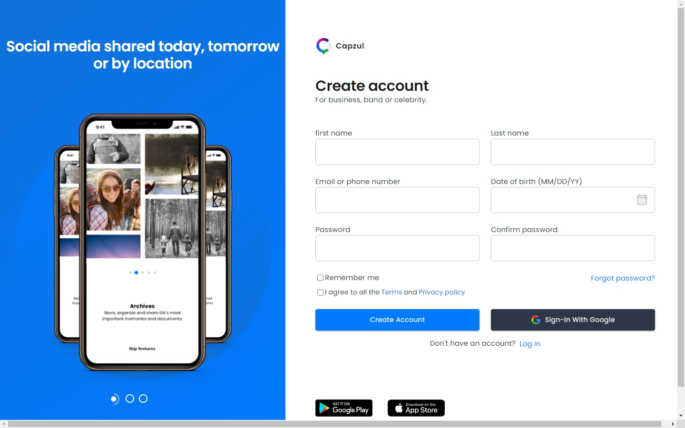
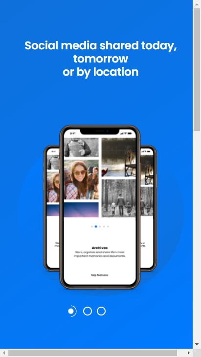

# Pyramid Finance interview assessment solution

created in fulfillment of the interview assessment process (Typescript)

# Table of contents

1. Installation
2. Project structure
3. Usage/user story
4. Author
5. Features
6. Tech stack
7. Appendix

## Installation

- clone repo
  ```
      git clone https://github.com/AdamuAbba/pyramid-finance-web.git
  ```
- install dependencies

  ```
      npm install
  ```

## Project structure

- Login Page

### Dell



### Ipad

  
 
 ### Iphone 14 pro max
 
 
### Macbook pro


### Google pixel 2



## User story

- A user registers and signs in with [Google Authentication](https://firebase.google.com/),
- A user registers and signs in with credentials,

## Author

- [Abba Adamu](https://github.com/AdamuAbba)

## 🔗 Links

<a href="https://www.facebook.com/izshytypes" target="_blank">

</a>
<a href="https://www.instagram.com/shytypes1028/" target="_blank">

</a>
<a href="https://twitter.com/shytypes1028">

</a>
<a href="https://abbaportfolio.netlify.app/"  target="_blank">

</a>
<a href="https://www.linkedin.com/in/abba-adamu-365a9b17a/">

</a>

## Features

- React js app.
- Form state handling with [react-hook-form](https://react-hook-form.com/)
- Basic form validation with [zod validation](https://zod.dev/)
- basic material theming with [Material UI](https://mui.com/)
- Next js framework [Next js](https://nextjs.org/)

## Tech Stack

**Client:** 


**Hosting:** 

## Appendix

**Implementation summary & component folder structure:**

```
Component "folder level"
│   Component.module.css
│   Component.tsx
│   index.tsx
```
